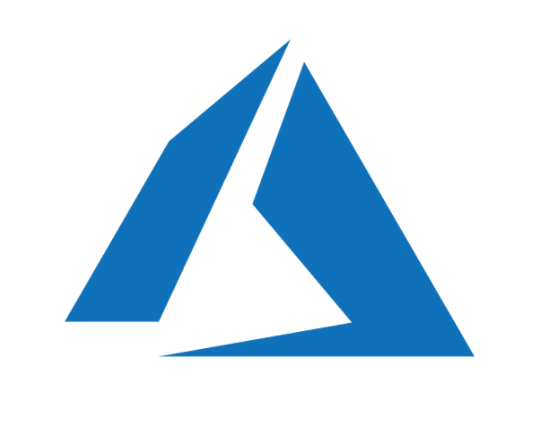

## What is this?

A collection of popular Exam questions, along with answers, and some code-snippets that will help you to prepare for exams. 

**Disclaimer** : The views expressed and the content shared are those of the author and dont reflext the views of the author's employer or cloudnloud platform

**we are not making any $$$ from it.Just helping community to share the knowledge.**

We collate the information in this repository through students submissions , if anyone finds the exact content elsewhere and from other authors, please reach out to us on **info@cloudnloud.com** and we will give appropriate credits in our content.

## Table of Contents

## Exam Questions

<!-- ALL-TOPICS-LIST:START -->
<!-- prettier-ignore-start -->
<!-- markdownlint-disable -->

<table>

  <tr>
	<td align="center"><a href="./azure-DP-900/readme.md"> <b>Azure-DP-900</b></a></td>
    
  </tr>
  
  
</table>

<!-- markdownlint-enable -->
<!-- prettier-ignore-end -->
<!-- ALL-TOPICS-LIST:END -->
